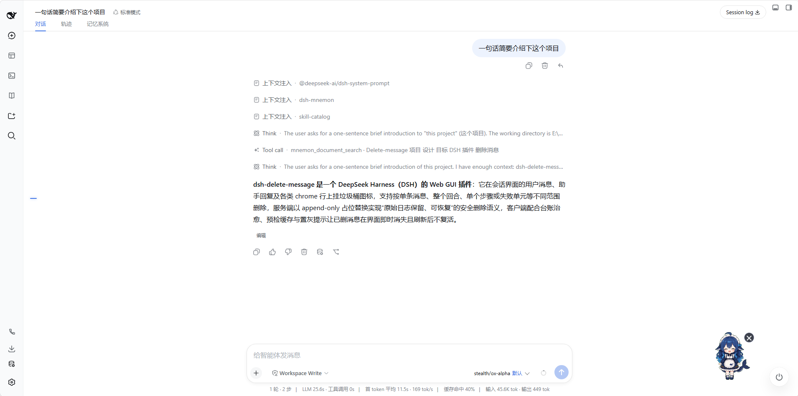
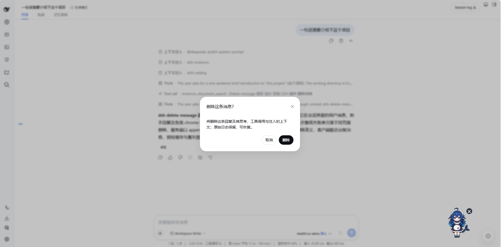
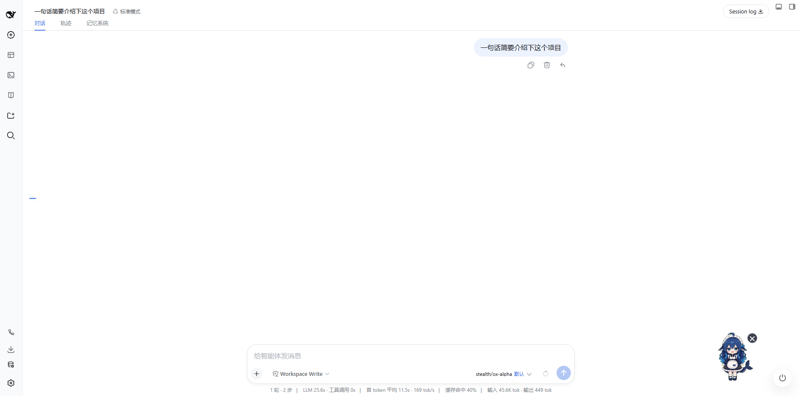

# dsh-delete-message

[简体中文](./README.md) | English

A per-message delete plugin for DeepSeek Harness that keeps accidental or mistaken messages out of the model context. It adds a delete button to the action area of every chat message: once confirmed, the message is removed from the **model context** through the host's official surface-replace contract (an assistant reply takes its thinking, tool calls, and injected context with it) and hidden from the **visible transcript**. Raw log bytes are never rewritten and can be recovered at any time.

## Features

- **All message types** — assistant replies mount in the official `conversation.chat.assistant-actions` slot; user input, machine-injected context rows, tool-call cards, THINK cards, model-retry lines, and terminal turn-error banners are enhanced via DOM augmentation (the host has no extension point for these sides). Chrome-row trash buttons (anything outside the user/assistant action strips) stay hidden by default and appear on message hover.
- **Native visual consistency** — reuses the host's icon and button geometry, the primitives `Tooltip`, and the `Modal`+`Button` confirm dialog; adapts to light and dark themes automatically.
- **Context-level deletion** — after confirmation, a `surfaceOp: { op: 'replace' }` placeholder node is appended (the same mechanism as the host's `/compact`); shadowed messages no longer enter `deriveMessages()`.
- **Transcript-level hiding** — the host's visible transcript is append-only by design, so the plugin maintains a per-session deleted-seq ledger (persisted in localStorage), resolves row wrappers' React fiber identities to hide matching rows, and heals historically deleted rows unknown to this browser via a `/status` preflight at load time.
- **Failed-turn cleanup** — turns that failed or were interrupted before any assistant reply landed (e.g. a 502 retry exhaustion) leave no assistant message, so the delete button had nowhere to mount and the injected context was stranded forever. Clicking the trash on any context row, tool-call card, or retry line replaces the **whole user-input unit** at once (injections, the reply, tool calls, and retry/error chrome go together; real user input is never touched).
- **Step-level deletion** — in multi-step turns, clicking the trash on a THINK card or tool-call card removes **only that step's** reply and tool calls (`assistant/message` + paired `tool/result`); other steps in the same window survive. The confirm title and tooltip explicitly state the scope ("Delete this step" vs "Delete entire attempt").
- **Role-aware confirmation** — the confirm dialog body is selected automatically from each mount's static message role; no user judgment required: a user message states its single-message scope, while an assistant reply states that its thinking, tool calls, and injected context are removed together with it.
- **Bilingual UI (zh/en)** — all UI copy (confirm dialogs, failure reasons, accessibility labels) ships with Chinese and English dictionaries, switched by browser language and host preference.

## Behavior Reference

Clicking the trash in different locations produces different deletion scopes, dialog titles, and tooltips:

| Click target | Deletion scope | Dialog title | Tooltip |
|---|---|---|---|
| THINK card 🗑️ | This step only | Delete this step? | Delete this step |
| Tool-call card 🗑️ | This step only (owning assistant/msg + tool/results) | Delete this step? | Delete this step |
| Context-injection row 🗑️ | Entire window | Delete entire attempt? | Delete entire attempt |
| Retry line / error banner 🗑️ | Entire window | Delete entire attempt? | Delete entire attempt |
| User message 🗑️ | That message only | Delete this message? | Delete |
| Assistant slot (beside copy) 🗑️ | Entire window (reply + thinking + tools + injected context) | Delete this message? | Delete |

> Step-level deletion applies to multi-step turns: only the target step's `assistant/message` and paired `tool/result` are removed; other steps in the same window survive. Whole-window cleanup is for one-shot sweeps of failed or interrupted turns.

## Screenshots







> Screenshot files live in [docs/screenshots/](docs/screenshots/); see that directory's README for what each image should show.

## Safety

- The server re-runs full validation before every deletion: only `user/message` and `assistant/message` surface nodes inside closed turns are accepted — real user input is a single-node replace, while assistant messages, machine-injected rows, and non-surface chrome anchors such as `tool/call` or `llm/retry` plan the whole user-input window as one unit; messages carrying tool calls cannot be deleted alone, already-shadowed messages and in-progress turns are refused with machine reason codes (localized in the UI).
- The HTTP write path requires a dual-condition fence: loopback peer address AND a local Host header.
- Zero configuration, zero runtime dependencies; the plugin never deletes files or rewrites logs.

## Installation (web profile)

```sh
dsh plugin --profile web add github:viplocco/dsh-delete-message#v0.1.4
```

After installing, **fully restart the DSH Web process** (the host-side plugin tree is read only at startup); the client bundle is served dynamically per request by the host, so updates take effect on a hard refresh.

## Development

```sh
pnpm test    # node --test
```

See [docs/DESIGN.md](docs/DESIGN.md) for architecture, host contracts, and design trade-offs. Contact: viplocco@qq.com

## License

MIT
